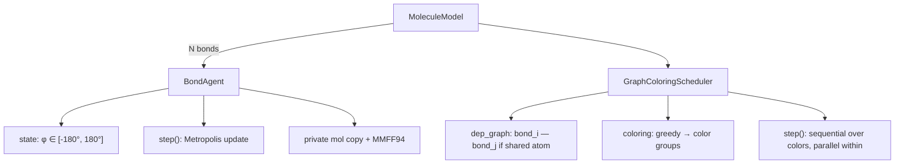
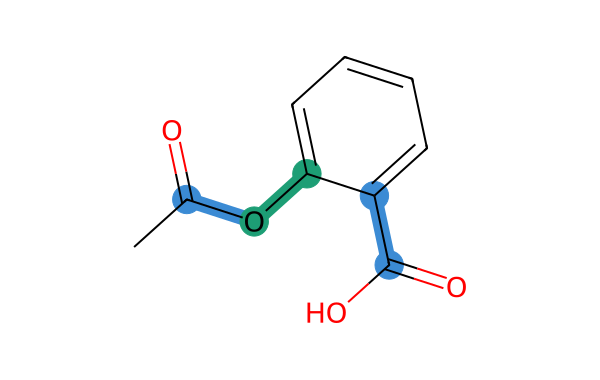
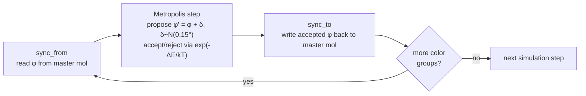

# Dihedral Agents

Agent-based conformational sampling of small organic molecules.

## Problem

Classic conformer generators like ETKDG (RDKit) rely on heuristics and statistics derived from crystal structure databases [1]. They are fast but often fail to cover the conformational space reliably — especially for molecules underrepresented in those databases, such as macrocyclic drugs [2] (a class of increasing pharmacological interest [3]). They also tend to return a single "best" structure rather than a diverse set of low-energy conformers. In drug discovery it is often more useful to have the full ensemble of low-energy conformations, since molecules interconvert between them in solution.

## Idea

Each rotatable bond (C–C, C–O, C–N single bond) in a molecule has exactly one degree of freedom: its **dihedral angle** φ ∈ [−180°, 180°]. A dihedral angle is defined by four consecutive atoms A–B–C–D as the angle between the plane A–B–C and the plane B–C–D. For a molecule with N rotatable bonds the full conformation is a point in R^N; the goal is to find points with low MMFF94 force field energy.

We treat each rotatable bond as an autonomous **agent** whose only state is its dihedral angle. Agents propose angle updates and accept or reject them using the Metropolis–Hastings criterion (standard MCMC acceptance rule). Parallelism is provided by a **graph-coloring scheduler**: two bonds cannot be updated simultaneously if they share an atom, so we build a dependency graph over bonds and color it — bonds of the same color form an independent set and can be updated in parallel without conflicts.

The optimization starts from an ETKDG-generated conformer as the initial point in R^N. The agents then perform MCMC over the energy function to find additional low-energy conformations.



## Rotatable bond detection

Not all bonds in a molecule are treated as agents. A bond is considered rotatable if and only if it passes the following SMARTS filter (applied on the heavy-atom graph, without hydrogens):

- **not** part of a ring (`!@`) — ring bonds cannot freely rotate
- **not** a triple bond
- **both** endpoints have at least two heavy neighbors (degree > 1) — terminal groups like –OH, –CH₃ are excluded since rotating them produces equivalent geometries
- **not** a heavily halogenated carbon (–CF₃, –CCl₃, –CBr₃) or tert-butyl group — these have effectively free rotation with no energetic preference

For aspirin this leaves 3 rotatable bonds out of 13 total bonds in the molecule:



Two bonds are considered **dependent** (connected in the dependency graph) if they share an atom, or are separated by exactly one atom in the molecular graph. The second condition is necessary for correct coloring of molecules where two rotatable bonds are connected through an aromatic ring carbon.

## Metropolis criterion

The Metropolis criterion is the acceptance rule used in Markov Chain Monte Carlo (MCMC) sampling. At each step an agent proposes a random perturbation δφ and decides whether to accept it:

```
P(accept) = min(1, exp(−ΔE / kT))
```

where ΔE = E_proposed − E_current, k is the Boltzmann constant, and T is temperature. This means:
- moves that lower energy (ΔE < 0) are always accepted,
- moves that raise energy are accepted with probability that decreases exponentially with ΔE and with lower T.

Temperature T controls the exploration–exploitation trade-off: high T allows the sampler to cross energy barriers and explore more of R^N; low T keeps it near local minima. At low T the sampler is susceptible to kinetic trapping — see Known challenges.

## Optimization procedure

### Proposal distribution

Each agent uses a **Gaussian random walk** to propose the next angle:

```
φ' = φ + δ,   δ ~ N(0, σ)
```

where σ = 15° is the step size. The agent does not reason about what angle would be good — it simply perturbs the current angle by a small random amount drawn from a normal distribution. The result is wrapped to [−180°, 180°] to stay in the valid range.

The step size σ controls a trade-off: small σ gives high acceptance rate but slow exploration; large σ explores faster but most proposals are rejected because the energy jump is too large.

### One simulation step

One simulation step iterates over each color group:



Energy is evaluated using the **MMFF94 force field** on the full molecule (not a local approximation), correctly accounting for non-bonded interactions between all atom pairs. Each agent holds a private copy of the molecule and force field, so updates within a color group are free of race conditions.

## Known challenges

**Kinetic trapping** — at low T the Metropolis criterion rarely accepts moves that increase energy, so the sampler gets stuck in a local minimum of the energy function [4]. A key reason is that escaping a local minimum often requires *coordinated* changes across multiple dihedral angles simultaneously — single-bond perturbations are insufficient [4]. Possible mitigations:
- Randomized starting angles (random point in R^N instead of the ETKDG geometry).
- Replica exchange (parallel tempering): run multiple instances at different temperatures and periodically swap configurations between them [5].

Note that within each color group the scheduler updates multiple bonds simultaneously (in the logical sense), which may partially alleviate this problem for bonds belonging to the same independent set.

This approach is a form of MCMC over dihedral space, with the agentic abstraction enabling parallelism via graph coloring. Analogous graph-coloring-based parallel update schemes appear in simulations of spin systems (e.g. checkerboard decomposition in Ising models) [6].

## Stack

| Component | Role |
|-----------|------|
| **RDKit** | SMILES parsing, 3D embedding (ETKDG), MMFF94 energy evaluation |
| **Mesa** | Agent-based model framework (`Agent`, `Model`, custom `Scheduler`) |
| **NumPy** | Vector math for dihedral computation |
| **Python 3.11** | Implementation language |

## Research questions

1. Does the ABM find low-energy conformations that ETKDG misses, particularly in regions of conformational space underrepresented in the training database?
2. How does scheduling strategy (graph-coloring vs. sequential vs. random) affect convergence speed and conformational coverage?
3. How does temperature T affect the exploration–exploitation trade-off?

## Validation

- Compare dihedral angle distributions: ABM histogram vs. ETKDG ensemble histogram.
- RMSD between final ABM conformation and lowest-energy ETKDG conformation.
- Optional: compare with experimental crystal structures from the Cambridge Structural Database (CSD) [7] — a curated repository of experimentally determined small-molecule 3D structures.

## References

- [1] Riniker, S.; Landrum, G. A. *Better Informed Distance Geometry: Using What We Know To Improve Conformation Generation.* J. Chem. Inf. Model. 2015, 55, 2562–2574. DOI: 10.1021/acs.jcim.5b00654
- [2] Wang, S.; Witek, J.; Landrum, G. A.; Riniker, S. *Improving Conformer Generation for Small Rings and Macrocycles Based on Distance Geometry and Experimental Torsional-Angle Preferences.* J. Chem. Inf. Model. 2020. DOI: 10.1021/acs.jcim.0c00025
- [3] Driggers, E. M.; Hale, S. P.; Lee, J.; Terrett, N. K. *The exploration of macrocycles for drug discovery — an underexploited structural class.* Nat. Rev. Drug Discov. 2008, 7, 608–624. DOI: 10.1038/nrd2590
- [4] Vitalis, A.; Pappu, R. V. *Methods for Monte Carlo Simulations of Biomacromolecules.* Annu. Rep. Comput. Chem. 2009, 5, 49–76. DOI: 10.1016/S1574-1400(09)00503-9
- [5] Swendsen, R. H.; Wang, J.-S. *Replica Monte Carlo simulation of spin glasses.* Phys. Rev. Lett. 1986, 57, 2607. DOI: 10.1103/PhysRevLett.57.2607
- [6] Preis, T.; Virnau, P.; Paul, W.; Schneider, J. J. *GPU Accelerated Monte Carlo Simulation of the 2D and 3D Ising Model.* J. Comput. Phys. 2009, 228, 4468–4477. DOI: 10.1016/j.jcp.2009.03.018
- [7] Groom, C. R. et al. *The Cambridge Structural Database.* Acta Cryst. B 2016, 72, 171–179. DOI: 10.1107/S2052520616003954
