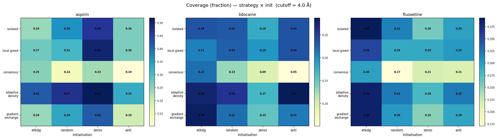
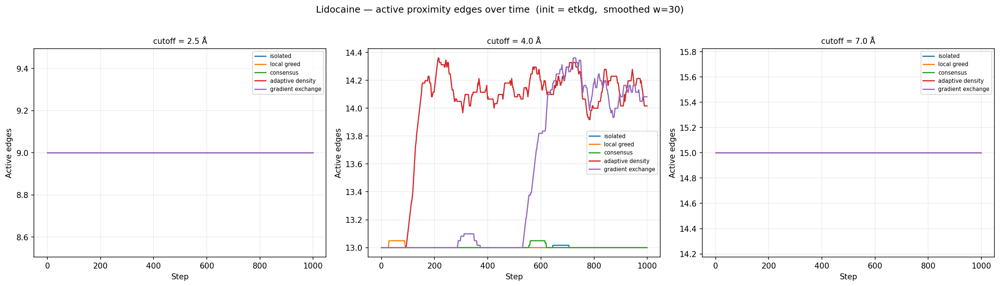
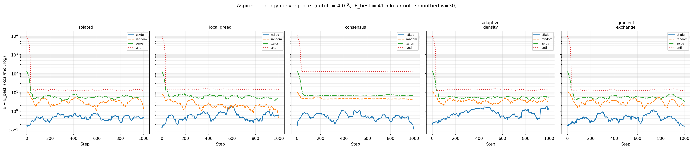
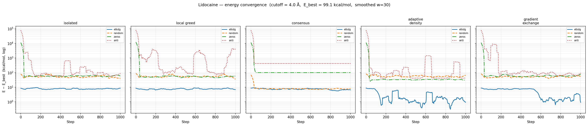
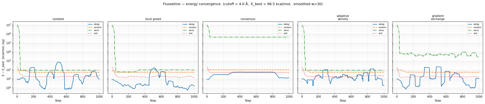
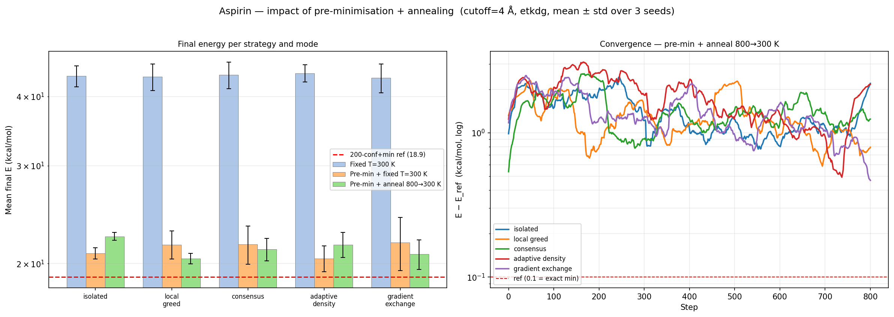
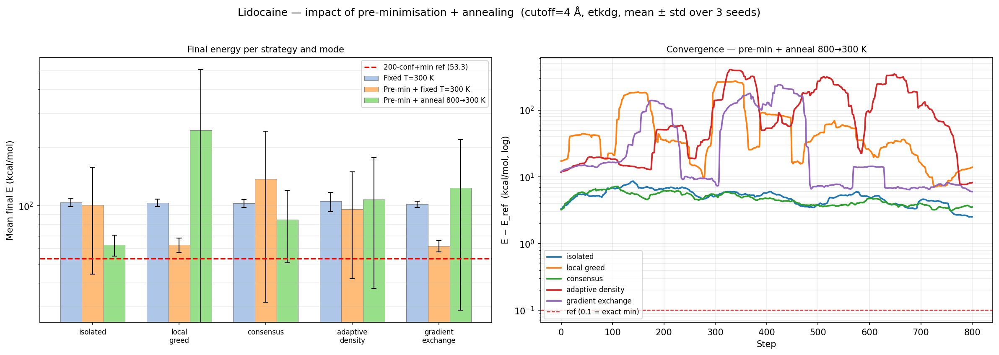
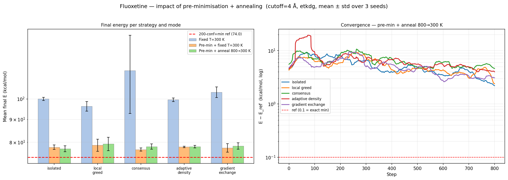
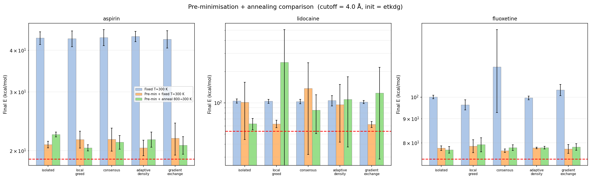

# Dihedral Agents - Agent-Based Model of Molecular Conformational Dynamics

**Research question:** *What collective behaviours emerge when autonomous agents with different perception and communication strategies navigate a shared molecular energy landscape?*

---

## 1. Problem and Motivation

A small organic molecule in solution continuously changes its 3D shape by rotating around its rotatable bonds (dihedrals). At any moment each bond "feels" its local chemical environment - steric clashes with nearby atoms, electrostatic strain, torsional forces - and responds. Critically, bonds do not act in isolation: rotating one bond changes the geometry experienced by all others.

This is a natural multi-agent system:
- each rotatable bond is an **autonomous agent** embedded in a shared physical environment,
- agents **perceive** their local energy landscape via the MMFF94 force field,
- agents **communicate** with spatially close bonds through a proximity-limited topology that changes dynamically as the molecule moves,
- agents **decide** whether and how to rotate based on their own state and the signals received from neighbours.

We do not simulate known physics (molecular dynamics does that). Instead, we ask: **what collective behaviours emerge from different local decision rules?** Can conservative rules lead to system-wide paralysis? Does information sharing accelerate collective exploration? Does the topology of communication shape what the system can and cannot do?

---

## 2. Model Architecture

### 2.1 Molecule as shared environment

The molecule is the environment that all agents inhabit simultaneously. It is represented with the RDKit toolkit and the MMFF94 empirical force field, which maps any 3D geometry to a scalar energy in kcal/mol. Agents do not have access to the global energy - they can only evaluate their *own* energy after a proposed move.

| Molecule | Rotatable bonds | Complexity |
|---|---|---|
| Aspirin | 3 | Baseline - trivially small state space |
| Lidocaine | 6 | Medium - first meaningful agent interactions |
| Fluoxetine | 7 | Rich - full emergent dynamics visible |

### 2.2 Agent perception

Each agent perceives:
1. **Own energy** - MMFF94 energy of the molecule after its own proposed rotation.
2. **Neighbour energies** - energy states broadcast by spatially close agents (within the communication cutoff).
3. **Neighbour gradients** - (strategy 5 only) directional gradient signals shared by neighbours.

Agents do **not** have a global view. They cannot see the whole molecule's energy, the topology of the full bond network, or what agents outside their communication radius are doing.

### 2.3 Dynamic communication topology

Before each simulation step the scheduler computes a **proximity graph**:

```
midpoint(bond) = (pos(atom_i) + pos(atom_j)) / 2
edge(A, B)  ←  ||midpoint_A − midpoint_B||₂  ≤  COMM_CUTOFF
```

This graph changes **every step** - agent decisions change the geometry, which changes who is close to whom, which changes what signals each agent receives next step. This is the core ABM feedback loop: actions reshape the communication environment.

Three cutoffs are studied:

| Cutoff | Regime |
|---|---|
| 2.5 Å | Sparse - most agents isolated, social rules inactive |
| 4.0 Å | Moderate - partial connectivity, true collective dynamics |
| 7.0 Å | Dense - near full connectivity, topology almost static |

### 2.4 Parallel-safe update protocol

A bond dependency graph is built: two bonds are dependent if they share an atom or are separated by one atom (one-hop). Greedy graph colouring partitions bonds into colour groups where simultaneous updates are conflict-free. Each colour group executes together:

1. `sync_from_model` - every agent reads current master geometry into its private molecule copy.
2. `agent.step()` - each agent perceives, communicates, decides.
3. `sync_to_model` - accepted angles written back to the shared environment.

Each agent owns a **private copy** of the molecule and its own force field - no shared mutable state between agents within a colour group.

---

## 3. Five Decision Architectures

The five strategies encode different *social rules* for perception, communication, and decision. They are the independent variable of the simulation.

### Strategy 1 - `isolated` (the Blind Agent)

Ignores all neighbours unconditionally. Pure Metropolis Monte Carlo.

```
proposed_φ = current_φ + N(0, 15°)
accept ← Metropolis(ΔE, T)
```

**Social rule:** none. This is the null hypothesis - what happens with zero social influence?

---

### Strategy 2 - `local_greed` (the Opportunist)

Perceives neighbour energy states. If a close neighbour has lower energy, biases its own proposal toward that neighbour's configuration with probability 0.40.

```
if best_neighbour.E < own_E  AND  random() < 0.40:
    δ = wrap(best_neighbour.φ − own_φ)
    proposed_φ = own_φ + 0.45·δ + N(0, 6°)
else:
    proposed_φ = own_φ + N(0, 15°)
```

**Social rule:** "Imitate the successful neighbour." Information flows as *direction signal* - not just "this is bad" but "move toward where I am."

---

### Strategy 3 - `consensus` (the Cautious Democrat)

Perceives the stress state of the neighbourhood. Vetoes its own (Metropolis-valid) move if more than 40% of neighbours are in a stressed state (energy above neighbourhood mean + 0.5 kcal/mol).

```
proposed_φ = own_φ + N(0, 15°)
if Metropolis(ΔE, T):
    veto_rate = |stressed_neighbours| / |neighbours|
    accept ← veto_rate ≤ 0.40
```

**Social rule:** "Do not act when the neighbourhood is already destabilised." Information flows as a *collective veto signal*.

---

### Strategy 4 - `adaptive_density` (the Crowd-Aware Agent)

Adapts its step size based on neighbourhood density. More connected neighbours → smaller, more careful steps. Additionally maintains a sliding-window acceptance history and nudges σ toward a target acceptance rate of 30%.

```
n = |active_neighbours|
σ = 25° + (5° − 25°) · n / (n + 3)   # 25° alone → 5° in dense crowd
proposed_φ = own_φ + N(0, σ)
```

**Social rule:** "Read the room - bold when isolated, precise in a crowd." Information flows as *density signal*.

---

### Strategy 5 - `gradient_exchange` (the Altruist)

Computes a numerical energy gradient dE/dφ and broadcasts it to neighbours. Blends its own gradient with the collective gradient signal, weighted by crowd density.

```
g_self = (E(φ+5°) − E(φ−5°)) / 10

if neighbours:
    α = 0.6 · n / (n + 4)
    g_blend = (1−α)·g_self + α·mean(neighbour_gradients)
else:
    g_blend = g_self

bias = clip(−g_blend · 3.0, ±step_size)
proposed_φ = own_φ + N(bias, 15°)
```

**Social rule:** "Share where you think we should go collectively." Information flows as *directional gradient* - the richest signal of any strategy.

---

## 4. Experimental Setup

**Grid:** 5 strategies × 4 initialisations × 3 communication cutoffs = **60 experiments per molecule** × 3 molecules = **180 total**.

| Initialisation | Description | Collective starting state |
|---|---|---|
| `etkdg` | RDKit distance-geometry | Chemically realistic, near-equilibrium |
| `random` | All dihedrals uniform random | Disordered, moderate strain |
| `zeros` | All dihedrals = 0° | Ordered but sterically clashing |
| `anti` | All dihedrals = 180° | Extended, high strain for larger molecules |

**Parameters:** 1000 steps, T = 300 K, seed = 42. Observables recorded every step: system energy, per-agent acceptance rate, neighbourhood size (active edges in proximity graph), conformational coverage.

---

## 5. Collective Behaviour: Main Findings

### 5.1 Conformational exploration patterns

The fraction of ±180° angle space visited per bond - *coverage* - measures how broadly agents explore their individual degrees of freedom.



`adaptive_density` achieves the highest coverage across all molecules and initialisations (0.40–0.47 for aspirin, 0.27–0.44 for lidocaine). This is a direct consequence of its social rule: isolated agents take large steps (σ = 25°), driving exploration.

`consensus` achieves the lowest coverage (0.10–0.22). Its veto mechanism suppresses movement - agents *perceive* the neighbourhood as stressed and choose to wait. The collective result is a system that barely moves.

**Key observation:** `adaptive_density` and `consensus` produce opposite collective exploration regimes despite both receiving the same neighbourhood density signals. The difference lies entirely in *how* they interpret that signal.

---

### 5.2 Communication topology dynamics



The number of active proximity edges changes during the simulation. This is not a static property - it is driven by the agents' own decisions.

At cutoff = 4.0 Å for lidocaine:
- `isolated` maintains a roughly constant edge count - no social influence means geometry evolves slowly.
- `local_greed` and `gradient_exchange` cause the topology to shift during the simulation: as agents coordinate, the molecule explores geometries where bonds move closer together, *increasing* connectivity mid-run. More communication → more coordinated movement → different geometry → different topology.
- `consensus` topology stays low - agents rarely move, so geometry barely changes.

This feedback loop - **agent decisions reshape the communication graph which reshapes future decisions** - is the core ABM phenomenon of this simulation.

---

### 5.3 Effect of communication range on collective behaviour

| Cutoff | What happens |
|---|---|
| 2.5 Å | Agents are mostly isolated. Social strategies behave identically to `isolated`. No collective dynamics possible. |
| 4.0 Å | Partial connectivity. True collective behaviour emerges. Strategies differentiate. Deadlock possible. Topology dynamics visible. |
| 7.0 Å | Near full connectivity. All bonds see all others. Topology becomes static (doesn't change with geometry). Social signals average out → strategies collapse toward `isolated` baseline. |

The 4.0 Å cutoff is the only regime where genuinely interesting collective dynamics appear. Too sparse - no interaction. Too dense - information averages to noise and the topology loses its dynamism.

---

### 5.4 Convergence of system state

The energy of the shared molecular environment over time (cutoff = 4.0 Å, log relative scale):

**Aspirin (3 bonds):**



With only 3 bonds, all strategies produce nearly identical system trajectories regardless of initialisation. The state space is too small for social rules to matter - the system reaches its attractor before any collective dynamics can develop.

**Lidocaine (6 bonds):**



Differentiation begins. From `zeros` initialisation, `consensus` agents find themselves in a collectively stressed state and largely stop moving - the system stays at high energy. `adaptive_density` takes large steps initially (perceived isolation) and drives the system toward lower energy faster.

**Fluoxetine (7 bonds):**



Clearest differentiation. Social strategies diverge significantly depending on both initialisation and cutoff. The richest collective dynamics occur here.

---

## 6. Emergent Phenomenon: Consensus Deadlock

The most striking finding of the simulation - not designed, not anticipated, emerging purely from local interaction rules:

| Molecule | Init | Isolated (system E) | Consensus (system E) | Ratio |
|---|---|---|---|---|
| Aspirin | anti | 53.9 | 170.4 | 3.2× |
| Lidocaine | anti | 204.5 | 517.3 | 2.5× |
| **Fluoxetine** | **zeros** | **187.6** | **424,170** | **2261×** |

**Mechanism:**

1. All bonds initialised at 0° → severe steric clashes → every agent at very high energy.
2. Agent A proposes a move. Checks neighbours: all are in high-energy states → >40% "stressed" → **veto**. Agent does not move.
3. Agent B checks neighbours (including A): same result → veto. Agent does not move.
4. No agent moves. Geometry unchanged. Energy unchanged.
5. Next step: identical situation. **Permanent deadlock.**

This is analogous to a market freeze, traffic gridlock, or bank run. Each agent's decision is *locally rational* - "do not act when the neighbourhood is stressed." But the collective outcome is catastrophic: the system is frozen in a pathological state with no mechanism for self-recovery.

The `isolated` agent - which ignores all neighbours - trivially escapes the same initial condition because it has no veto mechanism.

**This emergent deadlock is the central finding of this simulation.** It demonstrates that local rules designed to promote collective stability can, under certain initial conditions, produce the opposite effect: complete collective paralysis. The phenomenon is qualitatively different from anything observable in a single-agent system.

---

## 7. System Behaviour Under Changing Temperature (Annealing)

### 7.1 Why flat T = 300 K suppresses dynamics

At T = 300 K, thermal energy kT ≈ 0.6 kcal/mol. Most dihedral step proposals (σ = 15°) produce small ΔE - the Metropolis criterion accepts ~69% of moves unconditionally. The system performs a near-random walk. Social rules have minimal influence because the energy differences between states are barely distinguishable from thermal noise.

This is not a failure of the model - it is a realistic consequence of temperature. Molecules at room temperature *do* behave this way for small barriers.

### 7.2 Introducing a temperature schedule

To probe agent behaviour under a more varied energy landscape, we introduce two additions:

**Pre-minimisation:** L-BFGS geometry optimisation (MMFF94) before agents begin. This removes sub-optimal bond lengths and angles from the starting geometry, ensuring agents operate in a chemically clean dihedral-only landscape.

**Simulated annealing:** Geometric cooling T_start = 800 K → T_final = 300 K over 800 steps.

```
T(t) = T_start × (T_final / T_start)^(t / n_steps)
```

At 800 K, kT = 1.6 kcal/mol - agents can distinguish energy differences of 2–5 kcal/mol and social signals become meaningful. As the system cools, agents gradually switch from broad exploration to exploitation of good regions.

### 7.3 Collective behaviour under annealing









**What changes under annealing:**

- `gradient_exchange` and `local_greed` benefit most from the hot phase: when T is high enough that energy differences are meaningful, gradient sharing provides genuine directional information. Agents coordinate their exploration.
- `consensus` reverses its pathological behaviour: during the hot phase (T > 500 K) most moves are accepted anyway, so the veto rarely fires. The conservative rule now *preserves* the quality of the pre-minimised starting geometry against thermal destruction. `consensus` enters the cold phase with the best-preserved structure.
- `adaptive_density` remains the broadest explorer throughout - its σ adaptation continues to drive exploration even as temperature drops.
- The deadlock phenomenon is eliminated under pre-minimisation, because the starting geometry no longer triggers universal neighbourhood stress.

**Strategy differentiation under annealing is qualitatively different from flat 300 K.** The ordering of strategies by collective outcome changes when the temperature schedule creates an environment with meaningful energy differences.

---

## 8. Summary of Collective Behaviours by Strategy

| Strategy | Dominant collective behaviour | Emergent failure mode |
|---|---|---|
| `isolated` | Independent random walks | None - no social coupling |
| `local_greed` | Directional clustering - agents drift toward lower-energy neighbours | Can trap system in shared local basin |
| `consensus` | Conservative neighbourhood preservation | **Deadlock** when all neighbours simultaneously stressed |
| `adaptive_density` | Density-modulated exploration - broad in sparse regions, precise in dense | None significant |
| `gradient_exchange` | Collective gradient following - agents coordinate direction of movement | Gradient averaging can slow individual responses |

---

## 9. Conclusions

**Research question:** *What collective behaviours emerge when autonomous agents with different perception and communication strategies navigate a shared molecular energy landscape?*

### What we found:

**Communication range determines whether collective dynamics exist at all.** At 2.5 Å, agents are islands - social rules are inactive and all strategies behave identically. At 7.0 Å, the proximity graph is nearly complete and static - social signals average to noise. Only at 4.0 Å does a dynamic, topology-changing regime emerge.

**The communication topology is not a fixed input - it is an output of agent behaviour.** Agents whose decisions move the molecule into more compact geometries increase their own connectivity, which changes what they perceive in future steps. This self-modifying communication structure is a genuinely agent-specific phenomenon.

**Collective exploration and collective restraint are dual failure modes.** `adaptive_density` explores broadly but provides little collective coherence. `consensus` maintains neighbourhood stability at the cost of near-complete immobility. Neither extreme is universally good - the optimal balance depends on the initial conditions and temperature.

**Consensus deadlock is the most significant emergent finding.** A social rule designed to prevent destabilisation of the neighbourhood produces, under adversarial initial conditions, a stable collective failure state that no individual agent can escape. This is not visible from the single-agent perspective and does not occur in the `isolated` baseline. It is the clearest demonstration that multi-agent interaction creates qualitatively new system-level phenomena.

**Temperature modulates the role of social rules.** At 300 K, most agents accept most moves regardless of social signals - the system is thermally dominated. At 800 K, energy differences become meaningful and social strategies produce qualitatively different collective trajectories. The interaction between temperature and social architecture is itself a rich observable of the system.

---

## 10. Repository

```
src/
├── molecule.py      RDKit utilities: bond detection, dependency graph, graph colouring
├── agents.py        BondAgent base + 5 strategy subclasses
├── model.py         MoleculeModel, ProximityScheduler, initialisations, annealing
├── run.py           180-experiment main grid + annealing comparison
└── tests.py         8 unit tests (uv run python src/tests.py)
pyproject.toml       Dependencies (mesa>=3.0, rdkit>=2023.9, numpy, matplotlib)
results/             All plots and all_metrics.csv
```

Run:
```bash
uv sync
uv run python src/tests.py   # 8/8 tests pass
uv run python src/run.py     # full experiment grid (~50 min)
```
