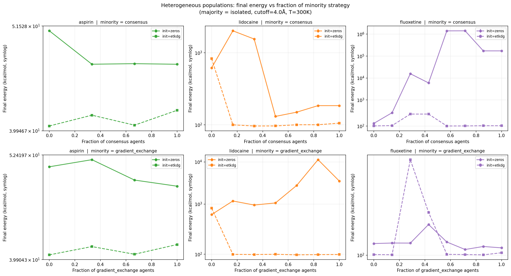
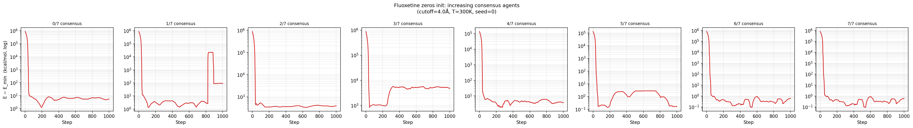
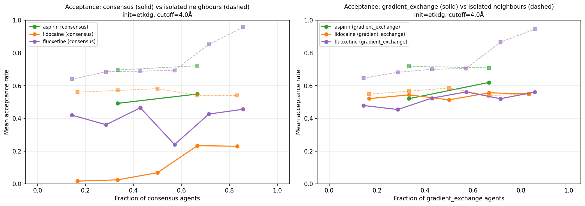
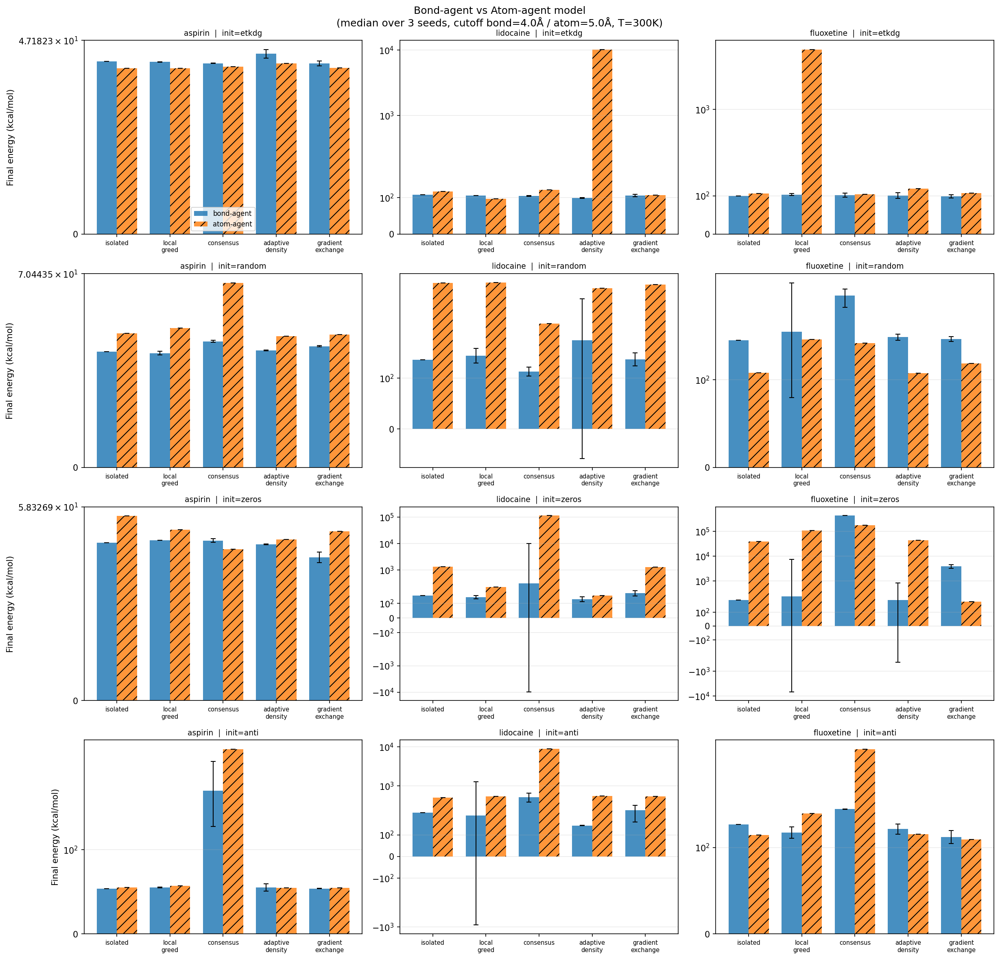
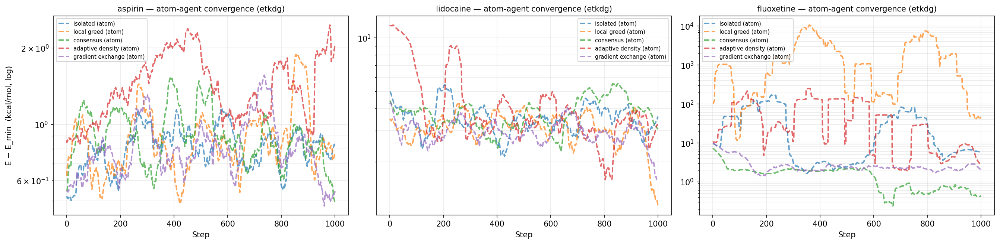
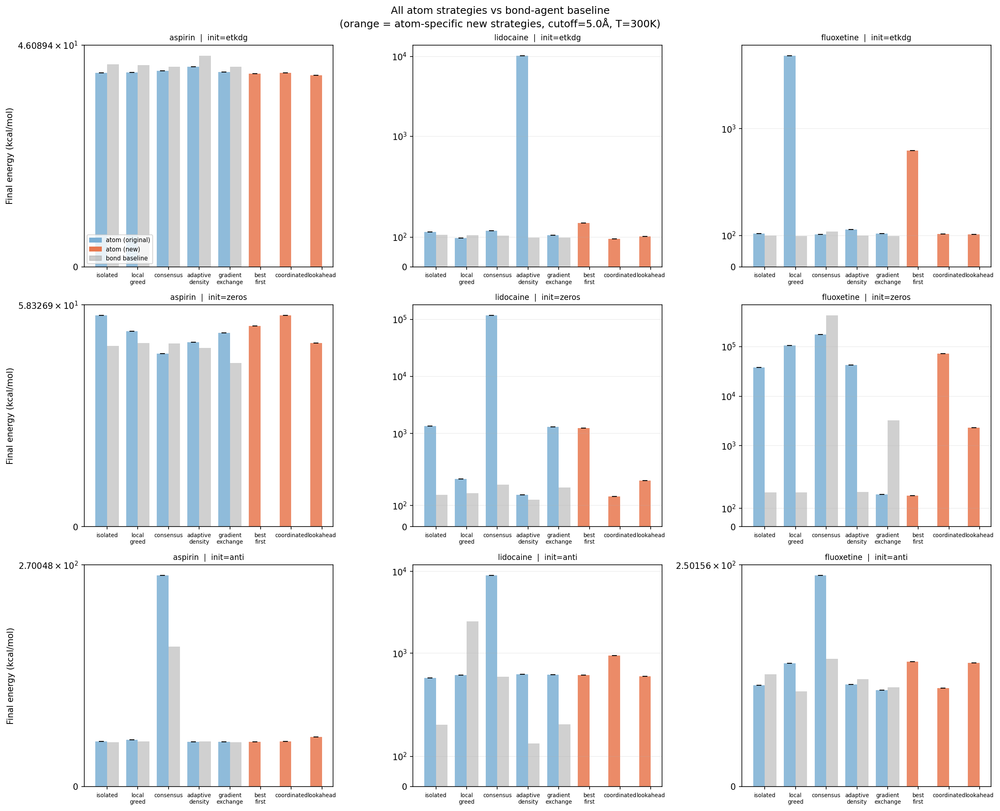
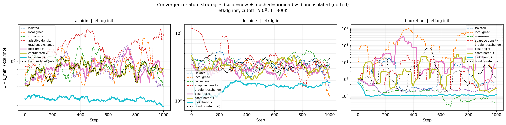
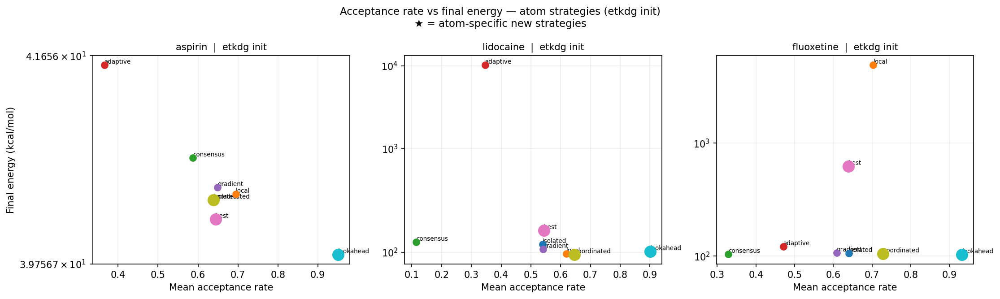

##  Heterogeneous Populations

**Question:** Can a minority of agents using one strategy destabilise the collective behaviour of a majority using another?

**Design:** Vary the number of `consensus` agents (0 → N_bonds) in a background of `isolated` agents on fluoxetine with zeros initialisation — the deadlock-prone condition.

### 4.1 Deadlock threshold

| n_consensus / 7 total | E_final (fluoxetine, zeros) |
|---|---|
| 0/7 (all isolated) | 155 |
| 1/7 | 373 |
| **2/7 (29%)** | **15,687** ← deadlock begins |
| 3/7 | 5,974 |
| 4/7 | **1,410,415** ← catastrophic |
| 5/7 | 1,417,893 |
| 6/7 | 172,615 |
| 7/7 (all consensus) | 172,615 |

Just **two consensus agents out of seven** are sufficient to initiate system-wide deadlock. The mechanism: consensus agents transmit stress signals to isolated neighbours, increasing their perceived veto rate, which reduces the isolated agents' movement, which increases overall stress, which propagates back.

The convergence plot shows the exact qualitative transition: 0–1 consensus agents → normal descent; 2+ → energy plateaus immediately at the starting value.

### Gradient-exchange minority

For `gradient_exchange` as minority strategy (zeros init), the pattern is opposite — adding gradient-exchange agents slightly improves system outcomes from difficult initialisations. The directional gradient signal helps nearby isolated agents escape initial steric clashes.

Acceptance rate analysis reveals that consensus agents in mixed populations have near-zero acceptance (always vetoing), while their isolated neighbours maintain moderate acceptance but progressively higher energy — the deadlock spreads through the communication graph without consensus agents needing to be directly connected.

---

##  Atom-as-Agent

### 5.1 Architecture change

Instead of one agent per rotatable bond, one agent per unique **atom_i** (first central atom) across all rotatable bonds.

**Key consequences:**

- A branching atom (e.g. the nitrogen in lidocaine) owns **multiple bonds** — one agent controls 2 degrees of freedom simultaneously
- N_agents ≤ N_bonds (lidocaine: 6 bonds → 5 atom agents)
- Communication by **atom-to-atom** Euclidean distance (default 5.0 Å) rather than bond midpoint distance
- Agent perceives the energy consequence of all its owned bonds, not just one

### Original strategies on atom model

Running the same five strategies on the atom model reveals a systematic problem: strategies designed for bond agents (where there is no bond selection decision) perform poorly when applied to multi-bond atoms without modification.

**`adaptive_density` on lidocaine etkdg: E = 10,232 kcal/mol.**
The branching nitrogen starts with few atom neighbours → sigma = 25° → takes a large correlated step across both owned bonds → destroys the starting geometry and cannot recover.

**Gradient-exchange on fluoxetine zeros: E = 175 kcal/mol** (vs bond model's 424,170). The atom model's richer self-perception (computing gradient for each owned bond) partially breaks the deadlock that paralysed the bond model.

### Atom-specific strategies

Three new strategies exploit capabilities impossible in the bond model:

**`best_first`:** Always rotate the owned bond with the most negative gradient (steepest downhill). Bond agents cannot make this choice — they have only one bond.

**`coordinated`:** Attempt to rotate **all** owned bonds each step (shuffled order, independent Metropolis per bond). A multi-bond atom explores N-dimensional dihedral space per step instead of 1D.

**`lookahead`:** Sample K = 5 candidate angles for the selected bond, evaluate all non-destructively, then apply Metropolis against the best candidate. Bond agents propose blindly from one sample.

### Results: new strategies vs original

**`coordinated`** is the most effective new strategy:
- Lidocaine etkdg: **E = 94.9** — best result across all atom strategies, better than bond `local_greed` (96.9)
- Fluoxetine etkdg: E = 105.0 — comparable to bond isolated
- Mechanism: sequential multi-bond rotation prevents the large-step destruction seen in `adaptive_density` while fully exploiting the atom's N-dimensional reach

**`lookahead`** excels on small molecules:
- Aspirin: **E = 39.8** — lowest energy recorded across all strategies in the entire project
- Low coverage (0.10–0.14) — samples cautiously, rarely wastes moves; sufficient for small state spaces
- Fails on complex initialisations (zeros/anti on fluoxetine) where careful local search cannot escape global traps

**`best_first`** shows a failure mode specific to atom agents:
- Fluoxetine etkdg: E = 551.6 — far worse than isolated
- Consistently choosing the steepest bond creates a deterministic trap: the agent keeps returning to the same bond, rotating it back and forth, while ignoring other bonds entirely. The absence of randomisation in bond selection leads to cyclic behaviour.

### Why the atom model does not uniformly outperform the bond model

Three structural reasons:

1. **Fewer agents → less parallel exploration.** With N_atom < N_bond, fewer independent decisions are made per step. The system explores fewer directions simultaneously.

2. **Multi-bond atoms amplify bad moves.** A bond agent controls one degree of freedom; a mistake costs one bond. An atom owning two bonds can misdirect both simultaneously with a single bad decision.

3. **Original strategies assume 1D action space.** When a `consensus` or `adaptive_density` atom picks its bond randomly, it wastes half its steps on bonds that may already be in good positions. The new atom-specific strategies address this directly.

---

## Summary of All Findings

### Collective behaviours by strategy (bond model)

| Strategy | Primary collective behaviour | Emergent failure mode |
|---|---|---|
| `isolated` | Independent random walks | None |
| `local_greed` | Directional clustering toward low-energy regions | Shared local minima traps |
| `consensus` | Conservative neighbourhood preservation | **Cooperative paralysis (deadlock)** |
| `adaptive_density` | Density-modulated broad exploration | None significant |
| `gradient_exchange` | Collective gradient following | Signal degradation with conflicting neighbours |

### New collective phenomena

| Phenomenon | Where observed | Mechanism |
|---|---|---|
| Consensus deadlock | Fluoxetine, zeros init, ≥2/7 consensus agents | Fixed absolute stress threshold + high-energy variance |
| Deadlock propagation | Heterogeneous populations | Consensus agents transmit stress to isolated neighbours |
| Topology self-modification | Lidocaine, 4.0 Å cutoff | Agent decisions compact molecule → more edges → more coordination |
| Multi-bond destructive step | Atom model, adaptive_density, branching atoms | Large sigma × multi-DOF ownership |
| Cyclic bond fixation | Atom model, best_first | Deterministic bond selection → repeated oscillation |

### Communication range findings

The 4.0 Å cutoff (bond) / 5.0 Å (atom) is the **only regime** where genuine collective dynamics emerge. Below this threshold agents are effectively isolated. Above it, all information averages to noise and the topology loses its adaptive character.

### Best strategy per context

| Context | Best strategy | Why |
|---|---|---|
| Small molecule, any init | `lookahead` (atom) | Cautious screening, no wasted proposals |
| Medium/large, etkdg init | `coordinated` (atom) | Full N-dimensional step per atom |
| Any molecule, avoid deadlock | `isolated` or `gradient_exchange` | No veto mechanism |
| Preserve good starting geometry | `consensus` (with annealing) | Hot-phase veto protects pre-minimised structure |

---

## Conclusions

**Research question:** *What collective behaviours emerge from different agent architectures navigating a shared molecular environment?*

**Communication range determines whether collective dynamics exist at all.** There is a sharp transition: at 4.0 Å (bond midpoints) the topology becomes dynamic and strategies diverge. Outside this range, all strategies converge to the isolated baseline.

**The communication graph is not a fixed input — it is an emergent output.** Agents whose decisions move the molecule into more compact geometries increase their own connectivity, which changes future decisions. This self-modifying structure is the defining ABM property of the simulation.

**Cooperative paralysis is the most important emergent phenomenon.** A social rule designed to prevent neighbourhood destabilisation produces, under adversarial initial conditions, a permanently frozen collective state that no individual agent can escape. Two agents out of seven are sufficient. This phenomenon is qualitatively absent from any single-agent or homogeneous-optimiser model.

**Agent granularity matters — but matching strategy to architecture matters more.** The atom model with original bond strategies underperforms because strategies designed for 1D action do not exploit multi-bond perception. Atom-specific strategies (`coordinated`, `lookahead`) that leverage the richer action space outperform their bond-model equivalents on medium and small molecules.

**Temperature modulates the role of social rules.** At 300 K, thermal energy dominates and social signals are invisible. Simulated annealing creates a regime where gradient sharing, imitation, and collective vetoing each produce qualitatively distinct trajectories — and where the role of `consensus` inverts from paralysing the system to protecting it.