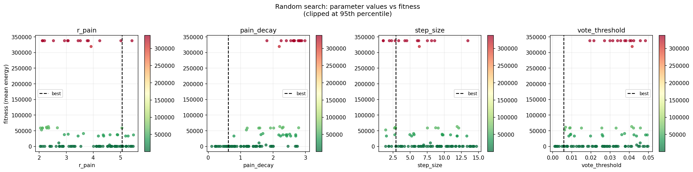
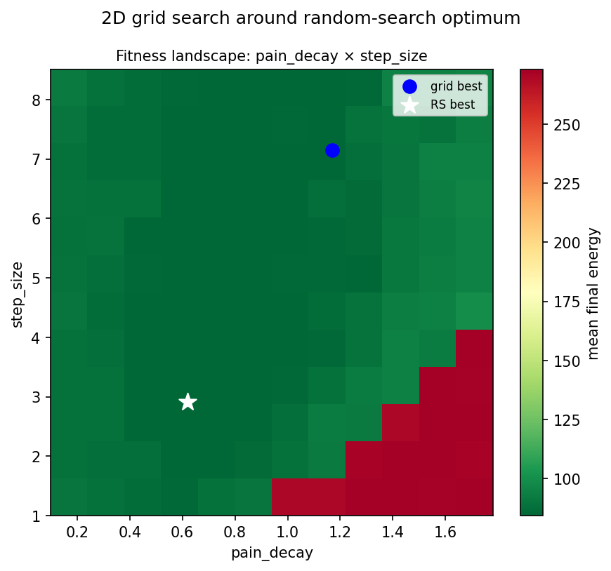
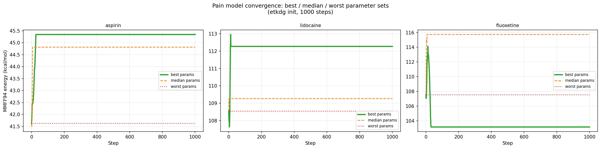
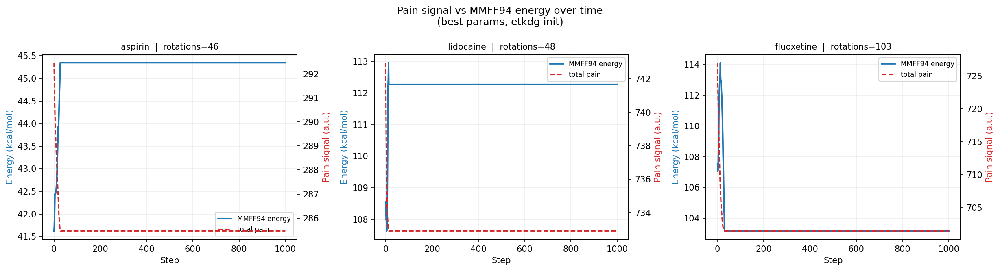

# Dihedral Agents — Agent-Based Model of Molecular Conformational Dynamics

**Course:** Modelling and Simulation of Systems — AGH University, Kraków  
**Research question:** *What collective behaviours emerge when autonomous agents with different perception and communication strategies navigate a shared molecular energy landscape — and how does the choice of agent granularity (bond vs atom) shape those behaviours?*

---
## Pain-Signal Model (No-Metropolis, Parameter Optimisation)

### 1.1 Motivation and design

All previous stages make decisions by evaluating MMFF94 energy — the agent already knows the full-field consequence of every proposed move. The pain-signal model asks: **can collective conformational dynamics emerge from a purely geometric, bio-inspired signal, with no energy evaluation in the decision loop?**

**Design:**

Every heavy atom is a **pain sensor**. Its pain is the sum of proximity deficits to all other atoms:

```
pain_i = Σ_{j≠i} max(0, r_pain − d_ij)
```

Zero when all neighbours are beyond `r_pain`; positive and growing when atoms crowd closer.

Each rotatable bond is a **rotor**. It receives a weighted pain signal from the whole molecule, attenuated by distance from the bond midpoint:

```
weighted_pain = Σ_i  pain_i × exp(−pain_decay × ||pos_i − midpoint||)
```

Each step the rotor non-destructively probes the weighted pain at +step_size and −step_size, and rotates in whichever direction reduces it by more than `vote_threshold`. If neither direction helps, it stays.

**No Metropolis. No MMFF94 evaluation during any decision.** MMFF94 energy is computed every step for *analysis only*.

### 1.2 Parameter space

| Parameter | Physical meaning | Search range |
|---|---|---|
| `r_pain` | Onset radius — atoms closer than this generate pain (Å) | 2.0 – 5.5 |
| `pain_decay` | How fast the signal attenuates with distance (Å⁻¹) | 0.1 – 3.0 |
| `step_size` | Rotation probed per direction (°) | 1.0 – 15.0 |
| `vote_threshold` | Minimum weighted-pain reduction to commit a rotation | 0.0001 – 0.05 |

**Fitness:** mean final MMFF94 energy across 3 molecules × 2 initialisations (ETKDG + zeros) × 2 seeds = 12 trajectories, 300 steps each.

### 1.3 Random search: parameter sensitivity



The scatter plot reveals an extremely bimodal landscape. The vast majority of the 100 sampled parameter sets (green, clustered near 85–90 kcal/mol) achieve good fitness. A smaller cluster of red points has fitness > 100,000 kcal/mol — three orders of magnitude worse.

**Spearman correlation (param → fitness):**

| Parameter | ρ | Interpretation |
|---|---|---|
| `pain_decay` | **+0.80** | Dominant — nearly monotonic relationship |
| `step_size` | −0.30 | Larger steps modestly help |
| `r_pain` | −0.28 | Larger onset radius captures more clashes |
| `vote_threshold` | +0.27 | Higher threshold suppresses useful rotations |

All bad (red) points in the scatter correspond to high `pain_decay` values, regardless of the other three parameters. `step_size`, `r_pain`, and `vote_threshold` have weak to moderate correlations — the model is largely insensitive to them as long as `pain_decay` is low.

**Top 5 parameter sets from random search:**

| Rank | r_pain | pain_decay | step_size | threshold | Fitness |
|---|---|---|---|---|---|
| 1 | 5.06 | 0.62 | 2.91 | 0.006 | 84.7 |
| 2 | 4.86 | 1.20 | 14.70 | 0.030 | 85.0 |
| 3 | 4.65 | 0.58 | 13.87 | 0.030 | 85.1 |
| 4 | 4.69 | 0.30 | 7.63 | 0.002 | 85.4 |
| 5 | 4.65 | 0.65 | 4.73 | 0.027 | 85.6 |

Top-5 span only 0.9 kcal/mol across very different combinations of step_size and threshold — confirming that these two parameters are nearly irrelevant once decay is low. The optimum is a broad, flat plateau, not a sharp peak.

### 1.4 2D fitness landscape: pain_decay × step_size



The landscape shows a hard phase transition at **pain_decay ≈ 0.9 Å⁻¹**:

- **Left of the cliff (decay < 0.9):** Nearly the entire region is uniformly dark green (~84–87 kcal/mol), regardless of step_size. The choice of step size is irrelevant in this regime.
- **Right of the cliff (decay > 1.0):** Fitness collapses to >200 kcal/mol for small steps; large steps partially compensate (top-right corner is lighter). With decay=1.7 Å⁻¹ and step=1°, the model essentially never rotates.
- **Grid best (blue dot) at decay≈1.2, step≈7.2:** This is the best point in the grid centred on the RS optimum; it falls on the boundary of the cliff where a large step overcomes the weaker signal. Grid-refined fitness: **84.1 kcal/mol**.
- **RS best (white star) at decay≈0.62, step≈2.9:** Comfortably inside the plateau — the exact location within the green region does not matter.

**Why the cliff exists:** The weighted pain signal at a bond midpoint is proportional to `exp(−decay × distance)`. At decay=1.0 Å⁻¹, a clash atom 4 Å from the bond midpoint contributes with weight `e^{−4} ≈ 0.018` — negligible. The bond only responds to clashes in its own immediate neighbourhood. At decay=0.3 Å⁻¹ the same atom contributes `e^{−1.2} ≈ 0.30` — sufficient for meaningful signalling. The critical `pain_decay` threshold is determined by the typical distance between the locus of a clash and the bond midpoints that could resolve it.

### 1.5 Convergence: best / median / worst parameters



This figure shows 1000-step trajectories from **ETKDG initialisation** only. Three paradoxes appear:

**Paradox 1 — best params increase energy from ETKDG:**  
Best params (green): aspirin 41.5 → 45.4 kcal/mol (+9%), lidocaine 108.0 → 112.5 (+4%). The model moves an already-good geometry and makes it worse.

**Paradox 2 — worst params achieve lowest energy from ETKDG:**  
Worst params (red dotted): aspirin stays at 41.5, lidocaine at 108.0. The model makes zero rotations. Since ETKDG already produces near-optimal conformers, the best ETKDG outcome is to do nothing.

**Paradox 3 — all convergence is front-loaded:**  
For all three molecules and all parameter sets, every trajectory plateaus before step 50. The remaining 950 steps contribute nothing — the model exhausts its action within the first 5% of the run.

These are not paradoxes in isolation — they all follow from the same mechanism. The fitness function averages ETKDG and zeros initialisations. The best parameters are selected because they dramatically reduce energy from the zeros (high-energy) start: lidocaine zeros 21,864 → 118 kcal/mol. This 18,000 kcal/mol reduction overwhelms the 3.5 kcal/mol penalty from displacing the ETKDG conformer. The **optimisation selects for clash resolution, not for quality of the final conformer.**

Exception: fluoxetine (7 bonds, most complex molecule) with best params shows a genuine improvement: ~114 → ~104 kcal/mol from ETKDG. Fluoxetine has a complex enough initial geometry that even ETKDG leaves some steric clashes, and the pain model can resolve them.

### 1.6 Pain signal vs MMFF94 energy over time



This is the central diagnostic plot for understanding what the model is actually doing.

**In all three molecules from ETKDG (best params):**
- **Pain (red dashed):** Drops sharply in the first 5–20 steps, then flat for the remaining 980+ steps
- **MMFF94 energy (blue):** Rises in the same window, then flat

Pain and energy move in **opposite directions**. The model is minimising pain (steric proximity) at the cost of increasing MMFF94 energy (which includes torsional, bond-angle, and electrostatic terms). For aspirin and lidocaine starting from ETKDG, the pain-optimal and energy-optimal conformations are different geometries.

**Rotation counts:** aspirin 46, lidocaine 48, fluoxetine 103 over 1000 steps. The model stops rotating after ~step 50 because pain has dropped below the threshold for any further improvement — but this leaves ≥ 950 idle steps.

**Fluoxetine is qualitatively different:** pain drops from ~725 to ~703 (−3.0%), energy drops from ~114 to ~104 (−8.8%). On this molecule, resolving pain and reducing energy are aligned. This suggests that fluoxetine's ETKDG conformer has genuine steric violations, not just torsional non-minima.

### 1.7 Honest assessment: what the model does and does not achieve

**What works:**

| Scenario | Behaviour |
|---|---|
| High-energy start (zeros, anti) | Dramatic energy reduction — pain signal efficiently identifies and resolves steric clashes |
| Convergence speed | Most improvement happens in ≤ 50 steps — very few targeted moves needed |
| Parameter robustness | Insensitive to step_size, r_pain, threshold — easy to use without fine-tuning |
| Interpretability | Mechanism is transparent: signal propagation range controlled by one parameter |

**What does not work:**

| Limitation | Root cause |
|---|---|
| Worsens ETKDG conformers (aspirin, lidocaine) | Pain ≠ MMFF94 energy; optimising steric proximity disrupts torsional minima |
| Idle after ~50 steps | No mechanism for sustained search — model is a one-shot clash resolver |
| Cannot escape local pain-minima | No thermal energy, no Metropolis — once in a pain basin, system is frozen |
| Fitness plateau is almost flat | Top-5 params differ by < 1 kcal/mol; the landscape has no sharp, tunable optimum |

**Comparison with energy-driven models:**

| Model | lidocaine zeros → E_final | lidocaine etkdg → E_final | Mechanism |
|---|---|---|---|
| Bond isolated (Metropolis, T=300 K) | ~108 | ~108 (stays similar) | Random walk + accept/reject |
| Atom lookahead (Metropolis, 5-sample) | ~105 | ~105 | Screened proposals |
| **Pain-signal (best params)** | **~118** | **~112 (worsens)** | Pure proximity signal |

The pain model is somewhat worse than Metropolis-based models from both starts. It has a fundamental ceiling: **it cannot find torsional minima**. It can only escape severe steric clashes. Below the pain threshold (`r_pain ≈ 5 Å`), the model sees no signal and makes no decision — the molecular dynamics are invisible to it.

**The correct interpretation:** the pain model is not a conformational search tool. It is a **collective steric collision-avoidance mechanism**. Its scientific value is demonstrating that a purely local, propagated signal with no global knowledge can produce structured collective behaviour — and that the signal propagation range (`pain_decay`) determines whether the collective response is coordinated or localised. This is an emergent property of the communication architecture, not of any individual agent's intelligence.

---